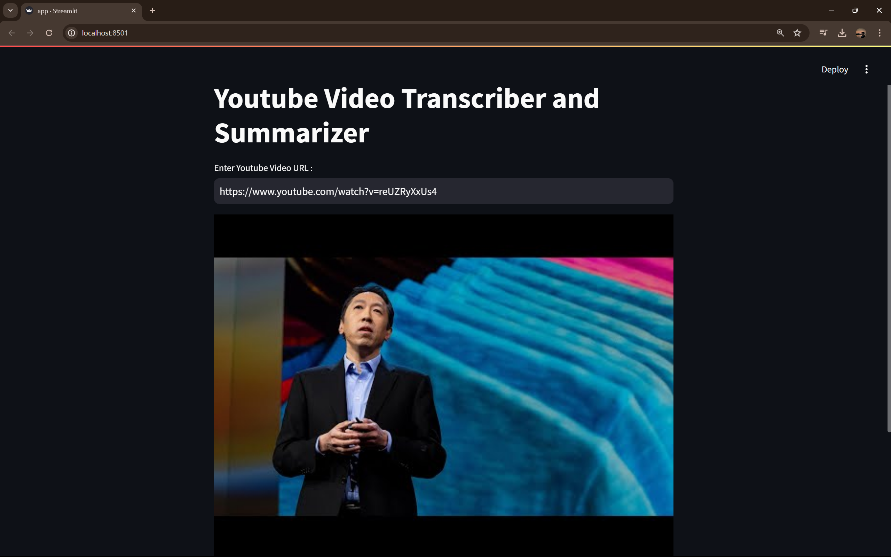

# YouTube Video Transcriber and Summarizer

This Streamlit application allows users to input a YouTube video URL, extract its transcript, and generate a detailed summary using Google Generative AI.

## Features
- Extracts transcript from a YouTube video using the `youtube_transcript_api`.
- Generates a summary of the transcript using Google Generative AI.
- Displays the thumbnail of the YouTube video.

## Requirements
- Python 3.8+
- Streamlit
- python-dotenv
- youtube_transcript_api
- google-generativeai

## Installation

1. Clone the repository:
   ```bash
   git clone https://github.com/MrProgrammerr/Youtube-Video-Transcribe-and-Summarizer
   cd Youtube-Video-Transcribe-and-Summarizer
   ```
Create a virtual environment and activate it:

```bash
python -m venv venv
source venv/bin/activate  # On Windows, use `venv\Scripts\activate`
```
Install the required packages:

```bash
pip install -r requirements.txt
```
Set up your environment variables:
Create a .env file in the project directory.
Add your Google API key in the .env file:
GOOGLE_API_KEY=your_google_api_key
## Usage
Run the Streamlit application:
```bash
streamlit run app.py
```
Open your web browser and go to http://localhost:8501.
Enter the URL of the YouTube video you want to transcribe and summarize.

Click on the "Get Transcribed Text" button to see the transcript.

Click on the "Get Detailed Summary" button to generate and view the summary.

## Screenshots

### Home Page


### Paste the Link


### Get Transcript


### Summarise it
